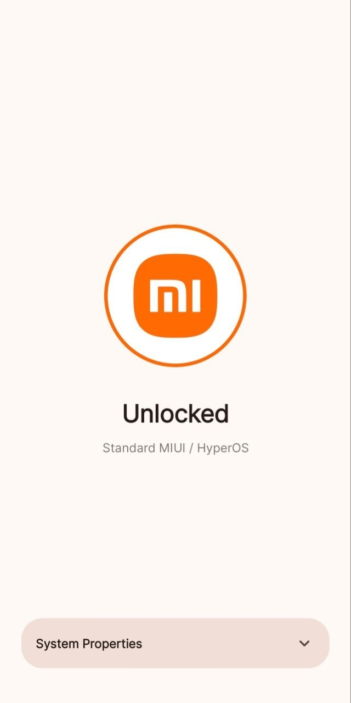
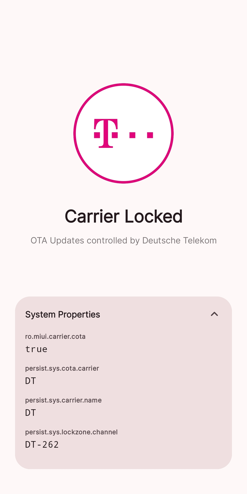

# MiCarrierCheck

A utility tool to identify carrier customization on Xiaomi devices.

Xiaomi phones often include hidden carrier-specific software (COTA) that controls things like pre-installed apps and network settings. This app reads internal system properties to show you exactly which carrier profile your device is running.

<p align="center">
  <a href="https://github.com/Double-A-92/MiCarrierCheck/releases/latest/download/app-release.apk">
    
  </a>
</p>

## Key Features

- **Identify Active Carrier**: See if your phone is using a specific profile from AT&T, Vodafone, Orange, etc.
- **Lock Check**: Instantly see if your device is under a COTA (Carrier Over-the-Air) lock.
- **Property Viewer**: Access the raw values of MIUI system properties for troubleshooting.

<p align="center">
  
  
</p>

## How it Works

The app checks the following MIUI system properties:
- `ro.miui.carrier.cota`
- `persist.sys.cota.carrier`
- `persist.sys.carrier.name`
- `persist.sys.lockzone.channel`

It then matches these values against our database of known Xiaomi carrier mappings to provide a human-readable display.

## How to Add More Carriers

If you find a carrier code that isn't recognized, you can easily add it to the project:

1.  **Find the Code**: Check the "Details" panel in the app to find the 2-letter code in properties like `persist.sys.cota.carrier` (e.g., "VF" for Vodafone).
2.  **Update the Registry**: Open `Carrier.kt` and add a new entry to the `CARRIER_REGISTRY` list:
    ```kotlin
    Carrier("Carrier Name", "CODE", Color(0xFFHEXCODE), "logos/carrier_logo.svg")
    ```
3.  **Add the Logo**: Place an SVG or PNG logo for the carrier in the `app/src/main/assets/logos/` directory.


